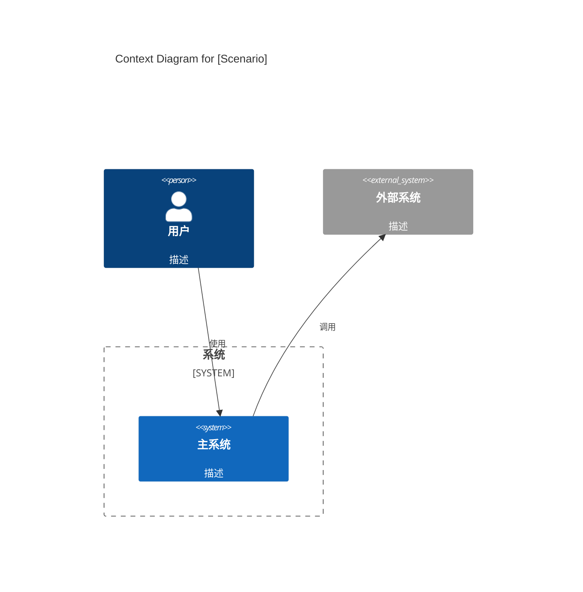
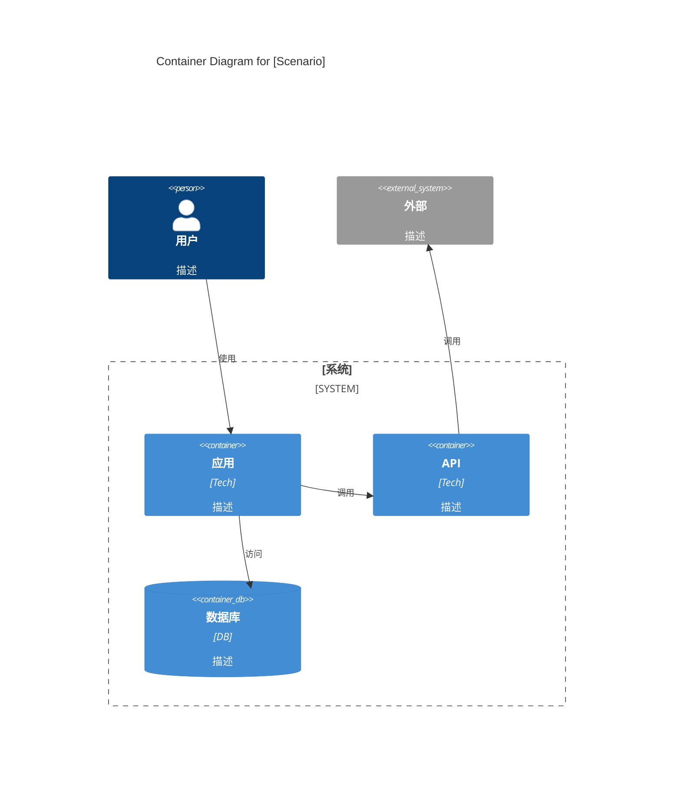
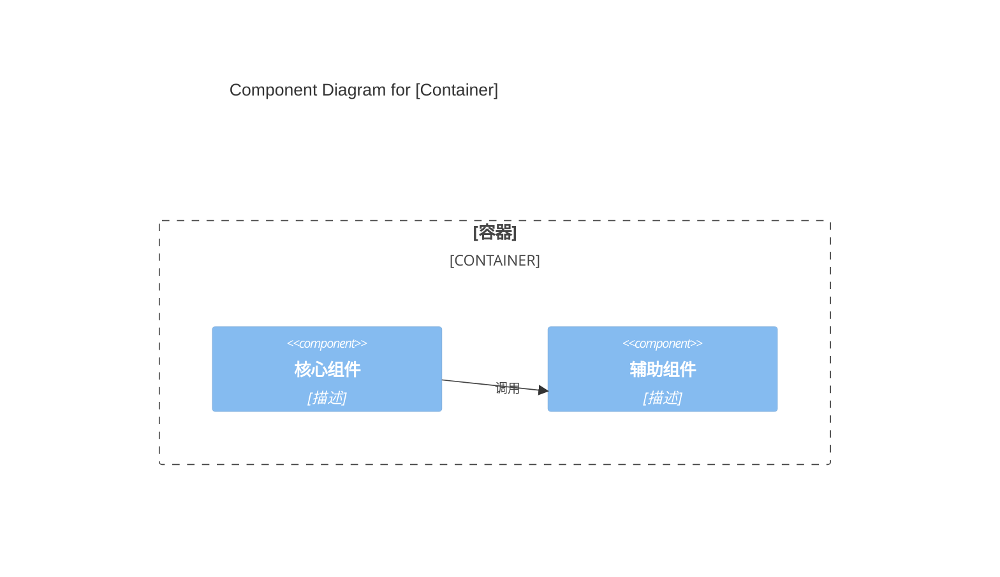
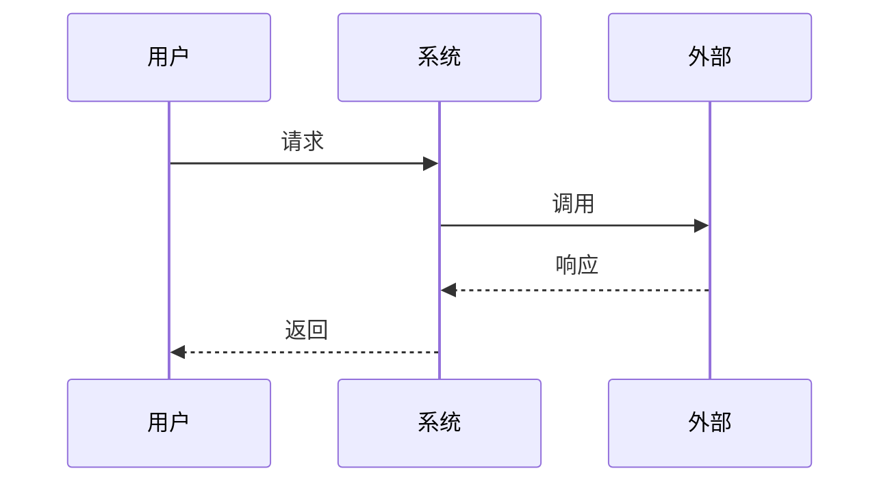
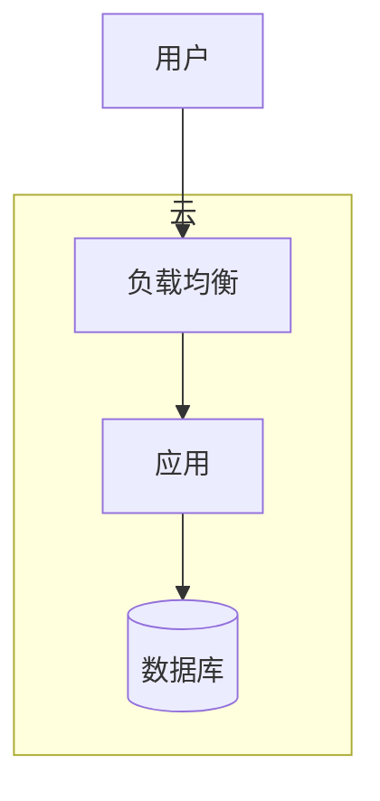
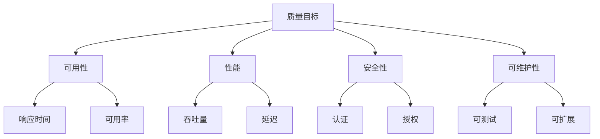

# Arc42 架构文档指南

> 使用 arc42 模板 + C4 Model 指导用户创建专业软件架构文档

## 关于 Arc42

**Arc42** 是一个开源的软件架构文档标准，由 Gernot Starke 博士和 Peter Hruschka 博士创建，在全球范围内广泛用于记录软件架构。

**核心理念**：文档经济但持续 - 只记录利益相关者真正需要的内容

---

## 12 个 Arc42 章节

| 章节 | 名称 | 优先级 | 目的 |
|------|------|--------|------|
| **1** | 介绍和目标 | **必填** | 需求概览，质量目标、利益相关者 |
| **2** | 约束条件 | 推荐 | 技术、组织、政治边界 |
| **3** | 上下文和范围 | 推荐 | 系统边界和外部接口 |
| **4** | 解决方案策略 | 推荐 | 基本决策和方法 |
| **5** | 构建块视图 | **必填** | 系统的静态结构 (C4 Model) |
| **6** | 运行时视图 | 推荐 | 动态行为场景 |
| **7** | 部署视图 | 推荐 | 基础设施和部署 |
| **8** | 横切概念 | 推荐 | 总体模式和规则 |
| **9** | 架构决策 | 推荐 | 带理由的 ADR |
| **10** | 质量要求 | 推荐 | 详细质量场景 |
| **11** | 风险和技术债务 | 可选 | 已知问题和风险 |
| **12** | 术语表 | 推荐 | 领域和技术术语 |

---

## 输出规格

### 详细程度: THOROUGH (完整版)

- 关键系统的完整文档
- 适合: 正式环境、审计要求、大型团队
- 包含所有 12 个章节

### 图表规格: C4 Model

使用 C4 Model 的三个层级，按场景拆分：

1. **Level 1: C4Context** - 系统上下文图
2. **Level 2: C4Container** - 容器图
3. **Level 3: C4Component** - 组件图

### 图表拆分原则

- 按用户角色/场景拆分图表，避免信息过载
- 每个图表聚焦一个场景或组件
- 图表后必须添加详细说明

---

## Q42 质量模型

| Q42 属性 | 说明 | 中文对应 |
|----------|------|----------|
| **#reliable** | 可用、容错、准确、一致 | 可靠性 |
| **#flexible** | 适应、可维护、可扩展、可移植 | 灵活性 |
| **#efficient** | 快速响应、高吞吐量、低资源使用 | 高效性 |
| **#usable** | 可学习、易操作、可访问、满意 | 可用性 |
| **#safe** | 无风险、故障安全、危险警告 | 安全性 |
| **#secure** | 保密、认证、访问控制 | 保密性 |
| **#suitable** | 功能完整、正确、可测试 | 适用性 |
| **#operable** | 易安装、部署、监控，维护 | 可操作性 |

---

## 章节工作流程

### 第 1 章: 介绍和目标 (必填)

**关键规则:**
- 质量目标 (1.2) 是**必填** - 没有质量目标就不能做架构工作
- 最多 3-5 个质量目标
- **必须具体可测量**

**质量目标示例：**

| 优先级 | 质量目标 | 具体场景 | 指标 |
|:------:|----------|----------|------|
| 1 | #usable | 开发者集成新 Provider | < 5 分钟 |
| 2 | #efficient | API 响应时间 | < 200ms (P99) |
| 3 | #reliable | 系统可用性 | > 99.9% |
| 4 | #operable | 部署时间 | < 10 分钟 |

❌ **错误示例:** "系统要快"
✅ **正确示例:** "API 响应时间 < 200ms (P99)"

### 第 2 章: 约束条件

**约束条件模板：**

```markdown
### 2.1 技术约束

| 约束 | 来源 | 影响 |
|------|------|------|
| Node.js >= 20.0.0 | 项目要求 | 兼容范围限制 |
| TypeScript | 技术栈 | 全栈 TS 开发 |

### 2.2 组织约束

| 约束 | 来源 | 影响 |
|------|------|------|
| 团队规模 3 人 | 资源限制 | 架构需保持简单 |
| 预算有限 | 财务 | 优先使用开源方案 |

### 2.3 政治/法规约束

| 约束 | 来源 | 影响 |
|------|------|------|
| GDPR 合规 | 法规 | 数据处理需加密 |
```

### 第 3 章: 上下文和范围

按用户角色拆分 C4Context 图：



### 第 4 章: 解决方案策略

**技术选型模板：**

```markdown
### 4.1 架构模式

| 模式 | 应用位置 | 理由 | 权衡 |
|------|----------|------|------|
| Monorepo | 全部 | 代码共享 | 构建时间 |
| Provider Adapter | pi-ai | 统一接口 | 适配器工作量 |

### 4.2 技术决策

| 类别 | 技术 | 版本 | 理由 |
|------|------|------|------|
| 语言 | TypeScript | >= 5.7 | 类型安全 |
| 运行时 | Node.js | >= 20.0.0 | 广泛支持 |
| 构建 | tsup | latest | 快速构建 |
| 测试 | Vitest | 3.x | 现代测试框架 |
```

### 第 5 章: 构建块视图

使用 C4 三层图，按场景拆分：

#### Level 1: C4Context (系统全景)


#### Level 2: C4Container (按场景)



#### Level 3: C4Component (组件详情)



### 第 6 章: 运行时视图

使用 sequenceDiagram：



### 第 7 章: 部署视图



### 第 8 章: 横切概念

**横切概念模板：**

```markdown
### 8.1 错误处理

**动机:**
[为什么需要这个概念]

**实现方式:**
- 分层错误处理: Transport → Agent → Tool
- 自动重试: 指数退避策略
- 错误传播: 工具错误返回给 LLM 决策

```typescript
// 示例代码
class AgentError extends Error {
  code: ErrorCode;
  recoverable: boolean;
}
```

### 8.2 安全

**认证:**
- API Key 认证
- OAuth 2.0
- AWS IAM

**授权:**
- 基于角色的访问控制 (RBAC)

### 8.3 监控

- 日志: 结构化日志 (JSON)
- 指标: Prometheus + Grafana
- 追踪: OpenTelemetry
```

### 第 9 章: 架构决策 (ADR)

**ADR 模板：**

```markdown
### ADR-001: [决策标题]

**状态:** 已通过 | 已废弃 | 已替代

**日期:** YYYY-MM-DD

**决策者:** [姓名]

**背景:**
[问题描述 - 为什么会需要这个决策]

**决策:**
[最终选择的解决方案]

**后果:**
- **正面:** [列出正面影响]
- **负面:** [列出负面影响]
- **中性:** [其他影响]

**替代方案:**
1. **方案 A** - [描述] - 拒绝原因: [为什么]
2. **方案 B** - [描述] - 拒绝原因: [为什么]

**相关决策:**
- ADR-002: [相关决策]
```

### 第 10 章: 质量要求

**质量树示例：**



**质量场景模板：**

| ID | 场景 | 刺激 | 响应 | 指标 | 优先级 |
|----|------|------|------|------|--------|
| Q-01 | API 响应 | 用户请求 | 收到响应 | < 200ms | 高 |

---

## 组件说明模板

每个图表后必须添加说明：

```markdown
**组件说明：**

| 组件 | 职责 | 设计要点 |
|------|------|----------|
| **组件名** | 职责描述 | 设计要点 |

**流程：**
1. 步骤1
2. 步骤2
```

---

## 接口文档模板

```markdown
### 接口定义

| 接口 | 方法 | 路径 | 请求 | 响应 | 说明 |
|------|------|------|------|------|------|
| 用户创建 | POST | /api/users | UserRequest | UserResponse | 创建新用户 |
```

---

## 开始使用

### 收集项目信息

1. 系统/领域是什么？
2. 主要利益相关者是谁？
3. 前 3-5 个质量目标是什么？（**必须具体可测量**）
4. 项目包含哪些包/模块？
5. 有哪些用户场景？
6. 有哪些技术约束？
7. 关键架构决策有哪些？

### 创建文档

生成 THOROUGH 级别文档，确保：
- 使用 C4 语法 (C4Context/C4Container/C4Component)
- 按场景拆分图表
- 每个图表后有详细说明
- 质量目标具体可测量
- 包含 ADR 决策记录

---

## 质量检查清单

- [ ] 使用 C4 语法
- [ ] 图表按场景拆分
- [ ] 包含 Level 1/2/3 三层
- [ ] 每个图表后有说明
- [ ] 质量目标具体可测量（如 "< 200ms"）
- [ ] 包含约束条件章节
- [ ] 包含技术选型决策
- [ ] 包含 ADR 记录
- [ ] 包含横切概念说明

---

## 常见错误

- ❌ 质量目标不可测量 ("要快" 而非 "< 200ms")
- ❌ 图表节点太多
- ❌ 没有按场景拆分
- ❌ 图表后没有说明
- ❌ 缺少约束条件
- ❌ ADR 没有记录后果

---

## 有效指导的技巧

**始终:**
- 使用 C4 语法
- 按场景拆分图表
- 图表后添加说明
- 质量目标具体可测量
- 记录架构决策及其后果

**永远不要:**
- 使用非 C4 语法
- 把所有内容放一个图
- 跳过质量目标
