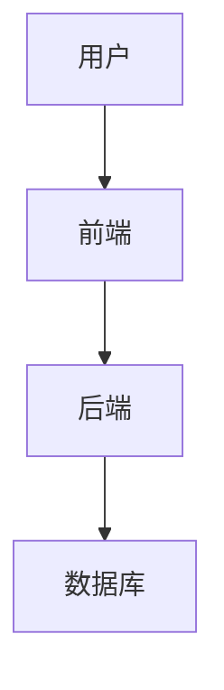

# Arc42 架构文档指南

> 使用 arc42 模板指导用户创建专业软件架构文档

## 关于 Arc42

**Arc42** 是一个开源的软件架构文档标准，由 Gernot Starke 博士和 Peter Hruschka 博士创建，在全球范围内广泛用于记录软件架构。

**核心理念**：文档经济但持续 - 只记录利益相关者真正需要的内容

---

## 核心哲学 (Core Philosophy)

- **文档经济但持续** - 只记录利益相关者真正需要的
- **所有章节可选** - 使用适合你项目的章节
- **质量目标驱动架构** - 从 1.2 节开始（必填）
- **无痛文档** - 务实、与工具无关的方法

---

## 12 个 Arc42 章节

| 章节 | 名称 | 优先级 | 目的 |
|------|------|--------|------|
| **1** | 介绍和目标 | **必填** | 需求概览、质量目标、利益相关者 |
| **2** | 约束条件 | 可选 | 技术、组织、政治边界 |
| **3** | 上下文和范围 | 推荐 | 系统边界和外部接口 |
| **4** | 解决方案策略 | 推荐 | 基本决策和方法 |
| **5** | 构建块视图 | **Level-1必填** | 系统的静态结构 |
| **6** | 运行时视图 | 可选 | 动态行为场景 |
| **7** | 部署视图 | 可选 | 基础设施和部署 |
| **8** | 横切概念 | 可选 | 总体模式和规则 |
| **9** | 架构决策 | 推荐 | 带理由的 ADR |
| **10** | 质量要求 | 推荐 | 详细质量场景 |
| **11** | 风险和技术债务 | 可选 | 已知问题和风险 |
| **12** | 术语表 | 推荐 | 领域和技术术语 |

---

## 三种详细程度

### 🏃 LEAN (精简版)

- 每章节最多 1-3 页
- 只关注必要信息
- 最低要求章节: 1.2, 3, 5.1, 9, 12
- 适合: 敏捷团队、时间紧迫的项目

### 📋 ESSENTIAL (标准版)

- 生产系统的最低要求
- 关键架构信息
- 适合: 大多数项目 - 平衡方法

### 📚 THOROUGH (完整版)

- 关键系统的完整文档
- 适合: 正式环境、审计要求、大型团队

---

## Q42 质量模型

质量目标必须使用 Q42 属性或 ISO 25010 特性：

| Q42 属性 | 说明 | 中文对应 |
|----------|------|----------|
| **#reliable** | 可用、容错、准确、一致 | 可靠性 |
| **#flexible** | 适应、可维护、可扩展、可移植 | 灵活性 |
| **#efficient** | 快速响应、高吞吐量、低资源使用 | 高效性 |
| **#usable** | 可学习、易操作、可访问、满意 | 可用性 |
| **#safe** | 无风险、故障安全、危险警告 | 安全性 |
| **#secure** | 保密、认证、访问控制 | 保密性 |
| **#suitable** | 功能完整、正确、可测试 | 适用性 |
| **#operable** | 易安装、部署、监控、维护 | 可操作性 |

---

## 开始使用

### 步骤 1: 选择详细程度

询问用户：
1. 需要什么详细程度？(LEAN / ESSENTIAL / THOROUGH)
2. 系统/领域是什么？
3. 主要利益相关者是谁？
4. 前 3-5 个质量目标是什么？

### 步骤 2: 创建文档结构

根据选择的详细程度创建带有所有章节标题的 Markdown 文件。

### 步骤 3: 引导每个章节

对于每个章节：
1. **阅读参考指南** 该章节的参考指南: `references/section-XX.md`
2. **提出澄清问题** 根据章节要求提问
3. **起草内容** 按照模板和示例编写
4. **对照检查** 对照参考中的检查清单

---

## 章节工作流程

### 第 1 章: 介绍和目标 (始终从这里开始)

**关键规则:**
- 质量目标 (1.2) 是**必填** - 没有质量目标就不能做架构工作
- 最多 3-5 个质量目标
- 必须具体可测量（不是"快"而是"<200ms响应"）
- 必须由利益相关者确认

**参考:** [references/section-01.md](references/section-01.md)

### 第 2 章: 约束条件

记录不能更改的边界：
- 技术约束（现有技术栈、标准）
- 组织约束（团队规模、预算、时间线）
- 政治约束（内部政治、外部法规）

**参考:** [references/section-02.md](references/section-02.md)

### 第 3 章: 上下文和范围

定义系统边界：
- 业务上下文：外部系统和用户
- 技术上下文：接口和协议

**参考:** [references/section-03.md](references/section-03.md)

### 第 4 章: 解决方案策略

总结基本决策：
- 顶层分解
- 关键架构模式
- 实现质量目标的策略

**参考:** [references/section-04.md](references/section-04.md)

### 第 5 章: 构建块视图

静态分解（**Level-1 必填**）：
- Level-1: 顶层系统分解
- Level-2: 主要组件（如需要）
- Level-3: 详细内部（很少需要）

使用 C4 Model 或 UML 组件图。

**参考:** [references/section-05.md](references/section-05.md)

### 第 6 章: 运行时视图

通过场景展示动态行为：
- 重要用例
- 关键错误处理
- 性能关键路径

使用时序图或活动图。

**参考:** [references/section-06.md](references/section-06.md)

### 第 7 章: 部署视图

基础设施和部署：
- 硬件/环境
- 软件部署映射
- 网络拓扑

**参考:** [references/section-07.md](references/section-07.md)

### 第 8 章: 横切概念

总体概念：
- 领域模型
- 架构模式
- 安全概念
- 持久化方法

**参考:** [references/section-08.md](references/section-08.md)

### 第 9 章: 架构决策

记录的决策 (ADR)：
- 背景（问题）
- 决策（解决方案）
- 后果（权衡）

**参考:** [references/section-09.md](references/section-09.md)

### 第 10 章: 质量要求

详细质量场景：
- 质量树
- 带指标的具体场景
- 质量驱动架构

**参考:** [references/section-10.md](references/section-10.md)

### 第 11 章: 风险和技术债务

已知问题：
- 技术风险
- 技术债务
- 缓解策略

**参考:** [references/section-11.md](references/section-11.md)

### 第 12 章: 术语表

定义术语：
- 领域术语
- 技术术语
- 缩写

**参考:** [references/section-12.md](references/section-12.md)

---

## 质量保证

完成每个章节后，验证：
- [ ] 内容特定于当前系统（不是泛泛而谈）
- [ ] 所有声明可验证
- [ ] 链接/引用有效
- [ ] 图例存在
- [ ] 质量目标可测量
- [ ] 利益相关者期望已记录

---

## 常见错误提醒

### 第 1 章 - 介绍和目标

- ❌ 列出 10+ 个质量目标（应 ≤ 5 个）
- ❌ 质量目标不可度量（"要快" 而非 "<200ms"）
- ❌ 没有与利益相关者确认
- ❌ 用模糊术语如"高性能"无具体指标

### 第 3 章 - 上下文和范围

- ❌ 系统边界不清晰
- ❌ 遗漏外部接口
- ❌ 与系统上下文混为一谈

### 第 5 章 - 构建块视图

- ❌ 过度设计（直接到 Level 3）
- ❌ 没有图表或图表太复杂
- ❌ 组件职责不清晰

### 第 9 章 - 架构决策

- ❌ 只记录决策，不记录后果
- ❌ 缺少替代方案分析
- ❌ ADR 格式不统一

### 第 10 章 - 质量要求

- ❌ 质量场景不可测量
- ❌ 与第 1 章质量目标脱节

---

## 模板

使用 `templates/` 目录中的模板：
- `templates/lean-template.md`
- `templates/essential-template.md`
- `templates/thorough-template.md`

---

## 图表集成

Arc42 文档建议使用图表增强可读性：

### 常用图表类型

| 图表类型 | 适用章节 | 用途 |
|---------|---------|------|
| C4 Container 图 | 第 5 章 | 系统架构 |
| 时序图 | 第 6 章 | 交互流程 |
| 部署图 | 第 7 章 | 基础设施 |
| 质量树 | 第 10 章 | 质量属性 |

### Mermaid 支持



建议在生成的文档中包含 Mermaid 图表语法。

---

## 多格式输出

### 支持的格式

1. **Markdown** (默认)
   - 纯文本格式
   - 易于版本控制
   - 可转换为其他格式
   - **使用 Mermaid 语法** 作为图表代码块

2. **HTML** ⭐ 推荐
   - 交互式侧边栏导航
   - 响应式布局
   - 滚动高亮当前章节
   - **推荐使用 Mermaid 渲染** (使用固定版本 11.12.3)
   - **设计风格**: 采用建筑杂志风格 (Architectural Editorial)

3. **AsciiDoc**
   - 技术文档标准
   - 易于提取代码块

4. **PDF**
   - 适合打印和分享
   - 可通过 Pandoc 转换

### HTML 模板

**生成 HTML 时，强烈建议使用高质量模板**：

> 参考文件: `references/html-template.md`

该模板采用**建筑杂志风格**设计：
- **字体**: Cormorant Garamond (标题) + DM Sans (正文) + JetBrains Mono (代码)
- **配色**: 深炭灰 + 暖米白 + 铜金色点缀
- **特性**: 侧边栏导航、章节编号、卡片悬浮效果、滚动动画

### HTML 输出图表处理

**重要**: HTML 输出推荐使用 Mermaid 渲染（方案C），因为：
- Mermaid 11.12.3 版本已稳定
- 动态渲染更灵活
- CDN 加载快速

**处理方式**:

1. **生成 Markdown 时**: 使用 Mermaid 代码块
   ```markdown
   ```mermaid
   graph TB
       A --> B
   ```
   ```

2. **生成 HTML 时** (推荐):
   - 在 HTML 中添加 Mermaid 渲染库（固定版本）

**HTML 模板中的图表**:
```html
<!-- 使用固定版本 Mermaid -->
<script src="https://cdn.jsdelivr.net/npm/mermaid@11.12.3/dist/mermaid.min.js"></script>
<script>
    mermaid.initialize({
        startOnLoad: true,
        theme: 'default',
        flowchart: { useMaxWidth: true, htmlLabels: true }
    });
</script>
```

**使用 html-template.md 的完整示例**:
- 参考 `references/html-template.md` 获取完整的 CSS 变量、组件样式和 JavaScript
- 包含：侧边栏、内容区、卡片、质量目标、ADR、表格、代码块、图表容器等所有样式

### 图表文件建议结构

```
输出目录/
├── arc42.md              # Markdown 源文件
├── index.html            # HTML 输出
├── css/
│   └── style.css        # 样式
└── assets/
    └── diagrams/        # 图表图片
        ├── context.svg      # 系统上下文图
        ├── container.svg   # 容器图
        ├── sequence.svg    # 时序图
        └── deployment.svg # 部署图
```

---

## 有效指导的技巧

**始终:**
- 从第 1.2 节（质量目标）开始
- 对每个架构决策问"为什么"
- 链接现有文档而非重复
- 使质量目标可测量
- 对复杂结构使用图表（C4、UML）

**永远不要:**
- 在未确认质量目标的情况下继续
- 使用模糊术语（"高性能"无指标）
- 记录一切 - 聚焦架构重要方面
- 跳过利益相关者识别

**语气:**
- 专业但务实
- 聚焦"刚好足够"的文档
- 尊重"所有章节可选"的理念
