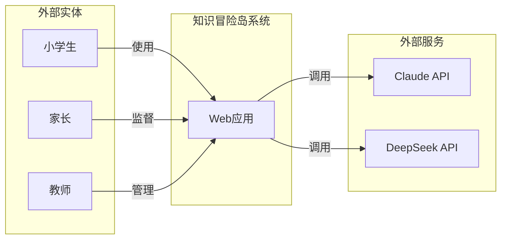
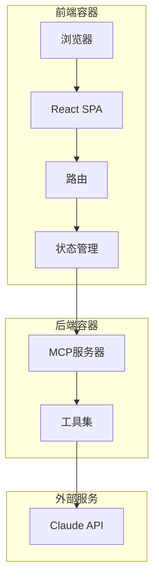
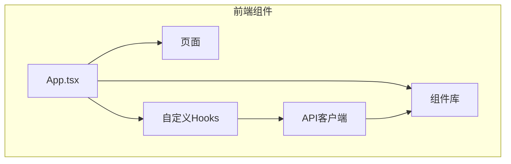
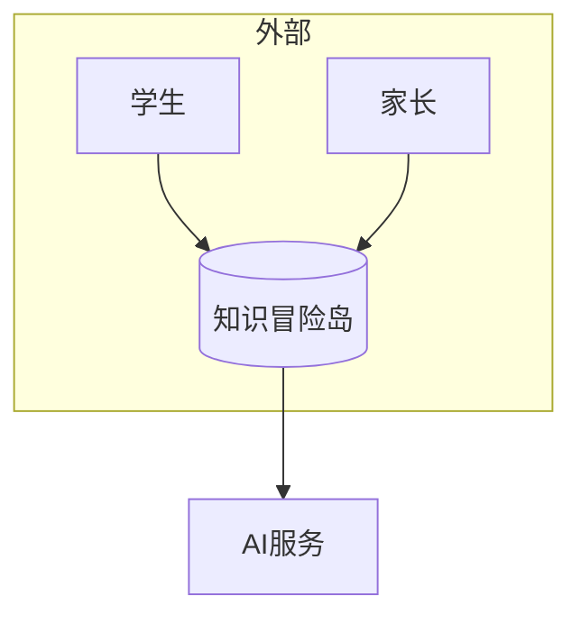
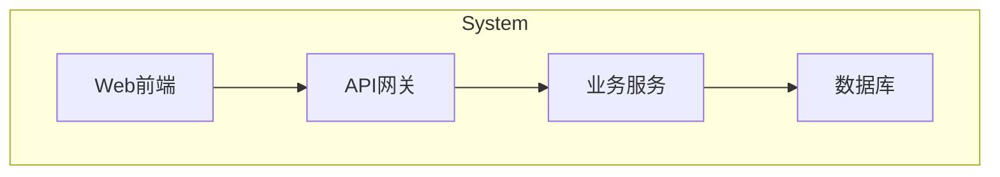
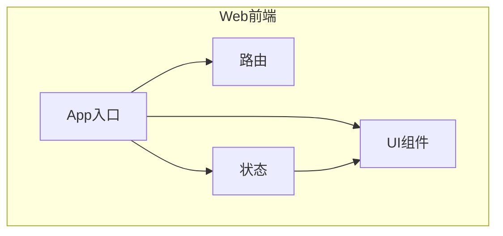
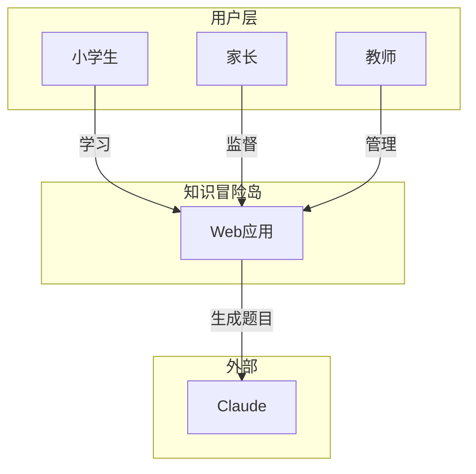
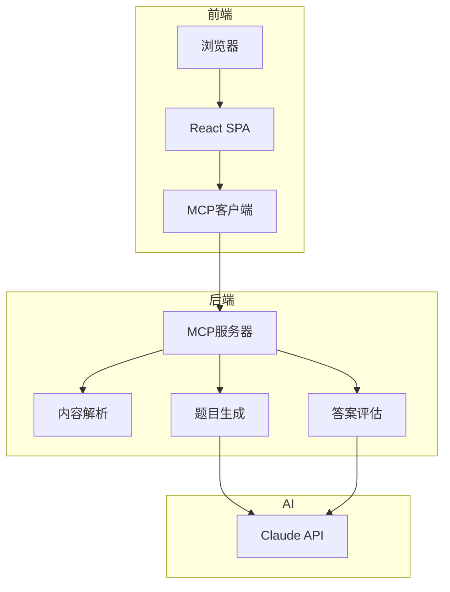
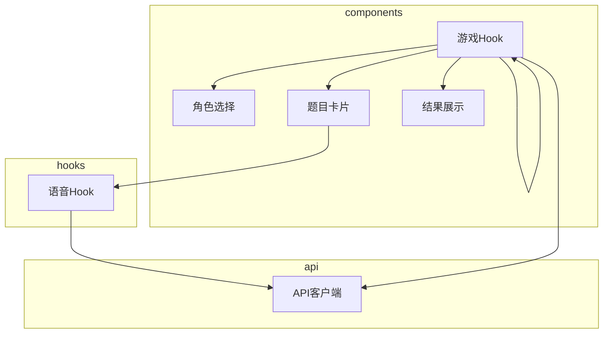

# Section 5: Building Block View

## Purpose

Show the static decomposition of the system into building blocks (modules, components, classes, packages). This is the most important structural view of the architecture.

## Levels of Abstraction

### Level 1: System Overview (MANDATORY)
- The entire system as one black box
- Shows major subsystems/components
- Maximum 7±2 elements

### Level 2: Major Components
- Decomposition of Level 1 elements
- Shows internal structure
- Only decompose what's architecturally significant

### Level 3: Detailed Internals
- Rarely needed
- Only for complex components
- Usually better in code documentation

## Format

### Level 1 Template

```markdown
### 5.1 Building Block Level-1

```
+------------------+         +------------------+
|   [Component A]  |---------|   [Component B]  |
+------------------+         +------------------+
         |                            |
         |                            |
         v                            v
+------------------+         +------------------+
|   [Component C]  |---------|   [Component D]  |
+------------------+         +------------------+
```

**Responsibilities:**
| Component | Responsibility |
|-----------|---------------|
| Component A | [Single sentence description] |

**Interfaces:**
| Interface | Component | Description |
|-----------|-----------|-------------|
| IF-1 | Component A -> Component B | [What is exchanged] |
```

### Level 2 Template (for selected components)

```markdown
### 5.2 Building Block Level-2: [Component Name]

[Decomposition of one Level-1 component]
```

## Notation Options

1. **C4 Model (Recommended)**
   - Level 1 = System Context (系统上下文)
   - Level 2 = Container diagram (容器图)
   - Level 3 = Component diagram (组件图)

2. **UML Component Diagram**
   - Standard notation
   - Good tool support

3. **Simple Boxes and Lines**
   - ASCII art or drawing
   - Focus on clarity over notation

## C4 Model with Mermaid

### C4 Level-1: System Context Diagram (系统上下文图)

展示系统与外部实体之间的关系。



**Level-1 说明:**
- 显示系统边界
- 展示外部参与者（人）
- 展示外部系统
- 关系用动词描述

---

### C4 Level-2: Container Diagram (容器图)

展示系统内部的主要构建块（容器）。



**Level-2 说明:**
- 分解系统内部的主要进程/服务
- 每个容器独立运行
- 展示容器间通信
- 标注协议 (HTTP, JSON-RPC, etc.)

---

### C4 Level-3: Component Diagram (组件图)

展示一个容器的内部组件。



**Level-3 说明:**
- 展示单个容器的内部结构
- 分解到类/模块级别
- 仅用于复杂容器
- 通常代码文档更合适

---

### 完整 C4 层级示例

#### Level-1: 系统上下文


#### Level-2: 容器


#### Level-3: 组件 (以Web前端为例)


---

### 实际应用示例

#### Level-1 示例


#### Level-2 示例


#### Level-3 示例 (前端组件)


## Input Questions

- What are the major subsystems/components?
- What is the responsibility of each component?
- How do components interact?
- Which components are architecturally significant?
- What interfaces exist between components?
- Are there shared/common components?

## Quality Checklist

- [ ] Level 1 is provided (mandatory)
- [ ] Each component has clear, single responsibility
- [ ] Components are at similar abstraction level
- [ ] Interfaces are documented
- [ ] Diagram is not too crowded (max 7±2 elements)
- [ ] Only architecturally significant details are shown
- [ ] Naming is consistent with domain language

## Common Mistakes

❌ **Too many components at Level 1** (more than 7-9)  
❌ **Mixed abstraction levels** (components and classes together)  
❌ **Missing responsibilities** (just boxes)  
❌ **No interfaces documented**  
❌ **Showing everything** (not just architecturally significant)  
❌ **Inconsistent naming**  
❌ **Level 3 when not needed**

## Example

```markdown
### 5.1 Building Block Level-1

```
+---------------------+     +---------------------+
|   Order Service     |-----|  Payment Service    |
|   (Spring Boot)     |     |  (Spring Boot)      |
+---------------------+     +---------------------+
           |                           |
           | Events                    | API Calls
           v                           v
+---------------------+     +---------------------+
|  Inventory Service  |     |  Notification Svc   |
|  (Spring Boot)      |     |  (Node.js)          |
+---------------------+     +---------------------+
           |                           
           | Query                     
           v                           
+---------------------+               
|  PostgreSQL         |               
|  (Primary DB)       |               
+---------------------+               
```

**Responsibilities:**
| Component | Responsibility |
|-----------|---------------|
| Order Service | Manages order lifecycle; validates orders; orchestrates checkout process |
| Payment Service | Processes payments; handles refunds; integrates with payment providers |
| Inventory Service | Tracks stock levels; reserves inventory; updates quantities |
| Notification Service | Sends emails, SMS, push notifications; manages templates |

**Interfaces:**
| Interface | Between | Description |
|-----------|---------|-------------|
| Order Events | Order -> Inventory | OrderCreated, OrderCancelled events |
| Payment API | Order -> Payment | REST API for payment processing |
| Inventory Query | Order -> Inventory | gRPC for real-time stock checks |

### 5.2 Building Block Level-2: Order Service

```
+------------------+     +------------------+     +------------------+
|   Order API      |-----|  Order Service   |-----|  Order Repository |
|   (Controller)   |     |  (Domain)        |     |  (Infrastructure) |
+------------------+     +------------------+     +------------------+
                                |
                                v
                         +------------------+
                         |  Event Publisher |
                         |  (Infrastructure)|
                         +------------------+
```

**Responsibilities:**
| Component | Responsibility |
|-----------|---------------|
| Order API | HTTP endpoints; request validation; DTO mapping |
| Order Service | Business logic; order state machine; validation rules |
| Order Repository | Database access; CRUD operations; query optimization |
| Event Publisher | Publishes domain events to message bus |
```
