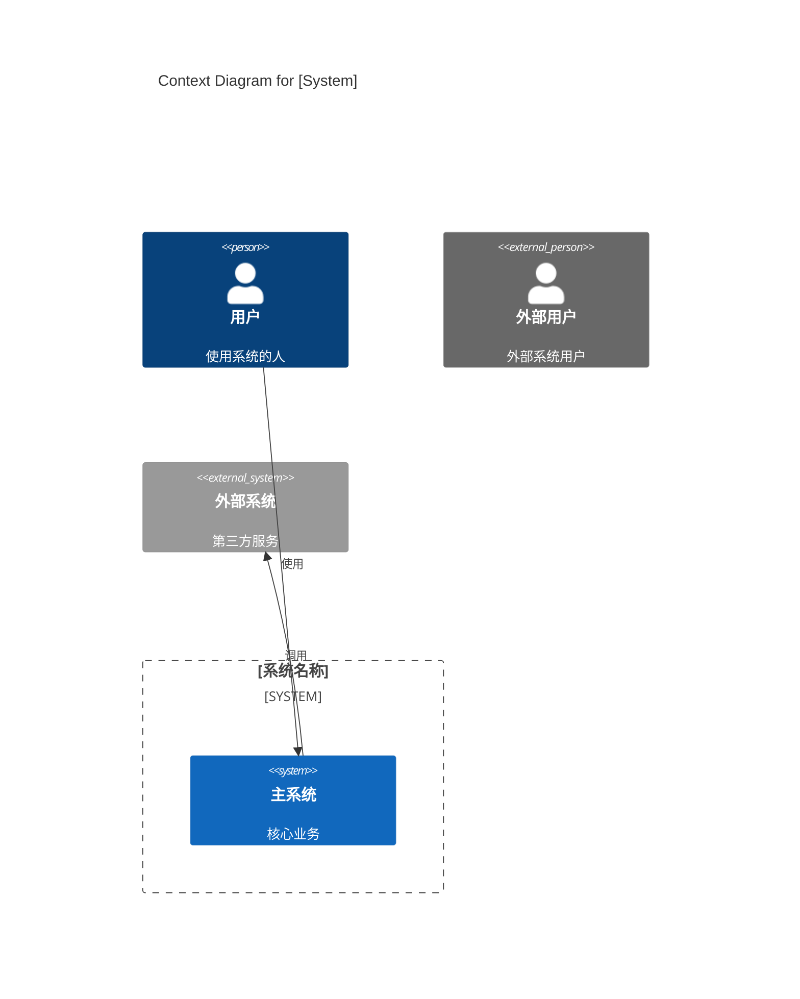
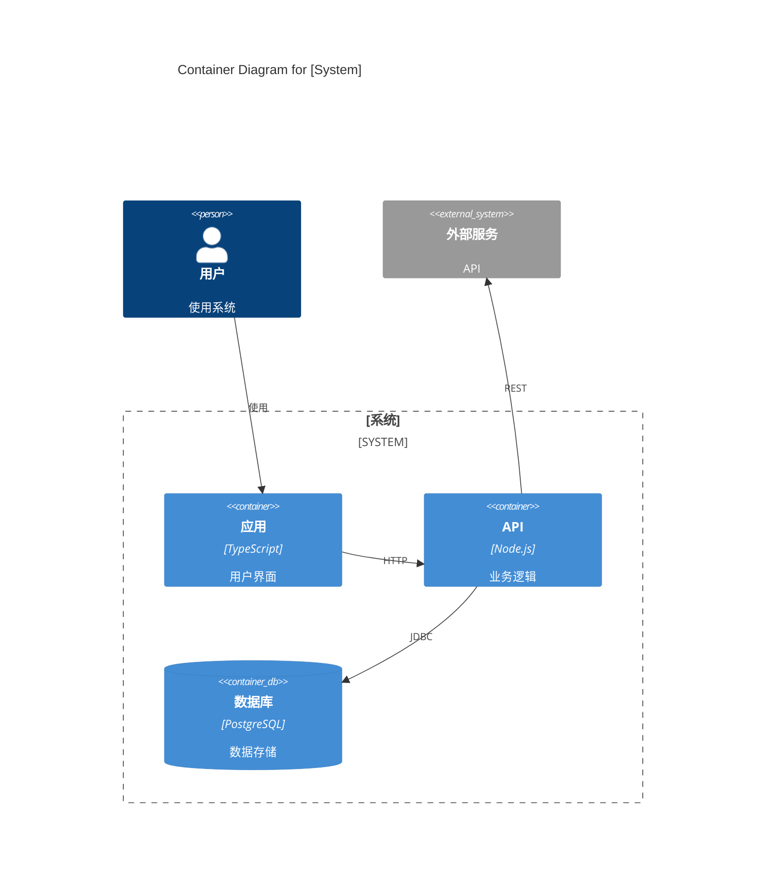
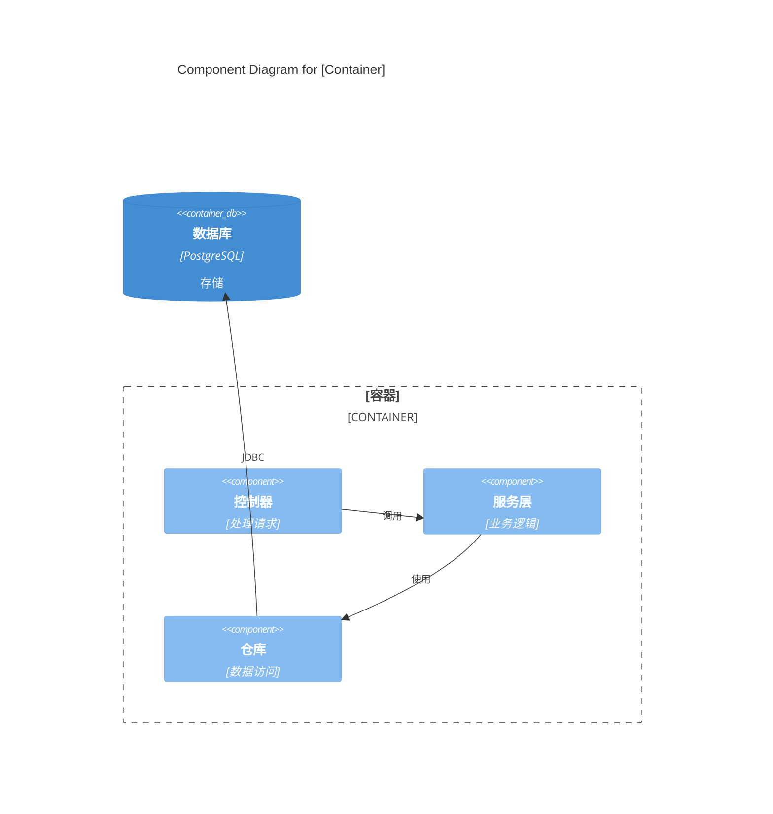
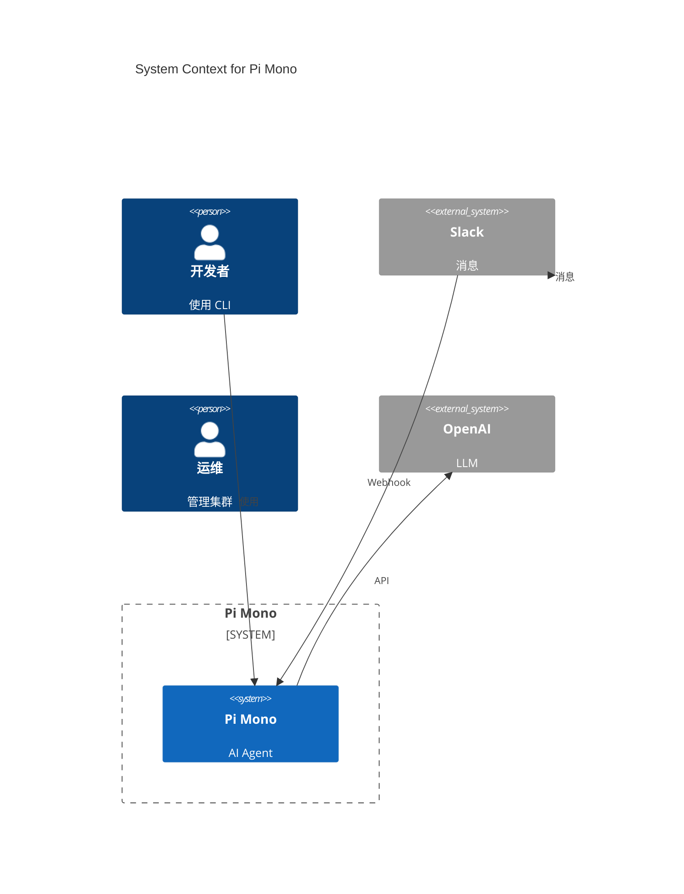
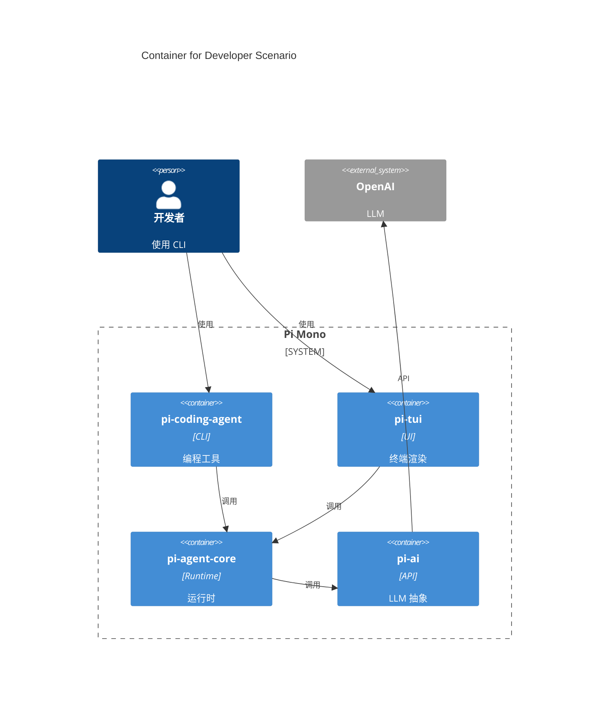

# Section 5: 构建块视图 (Building Block View)

## 目的

展示系统的静态分解为构建块，使用 C4 Model。

## C4 语法

### Level 1: C4Context

系统上下文图，展示系统与外部的关系：



### Level 2: C4Container

容器图，展示技术构建块：



### Level 3: C4Component

组件图，展示容器内部结构：



---

## 图表拆分原则

### 按场景拆分

每个图表应该聚焦一个场景：

**第 3 章**：按用户角色
- 场景 A: 开发者使用 CLI
- 场景 B: Web 用户
- 场景 C: 运维管理

**第 5 章**：按组件/子系统
- 5.1 系统全景 (Level 1)
- 5.2 场景 A 架构 (Level 2)
- 5.3 场景 B 架构 (Level 2)
- 5.4 组件 X (Level 3)
- 5.5 组件 Y (Level 3)

---

## Pi Mono 示例

### 5.1 系统全景 (Level 1)



### 5.2 开发者场景 (Level 2)



### 5.3 pi-ai 组件 (Level 3)

```mermaid
C4Component
    title Component for pi-ai

    System_Ext(openai, "OpenAI API", "GPT")
    System_Ext(anthropic, "Anthropic API", "Claude")

    Container_Boundary(ai, "pi-ai") {
        Component(client, "LLMClient", "统一入口")
        Component(registry, "ProviderRegistry", "注册表")
    }

    Component_Boundary(providers, "Providers") {
        Component(openai_p, "OpenAIProvider", "适配器")
        Component(anthropic_p, "AnthropicProvider", "适配器")
    }

    Rel(client, registry, "获取")
    Rel(registry, openai_p, "注册")
    Rel(registry, anthropic_p, "注册")
    Rel(openai_p, openai, "HTTP")
    Rel(anthropic_p, anthropic, "HTTP")
```

---

## 组件说明格式

每个图表后添加说明：

```markdown
**组件说明：**

| 组件 | 职责 | 设计要点 |
|------|------|----------|
| **组件名** | 职责描述 | 设计要点 |

**流程：**
1. 步骤1
2. 步骤2
```

---

## 检查清单

- [ ] 使用 C4 语法 (C4Context/C4Container/C4Component)
- [ ] 按场景拆分图表
- [ ] 包含 Level 1/2/3 三层
- [ ] 图表后有说明
