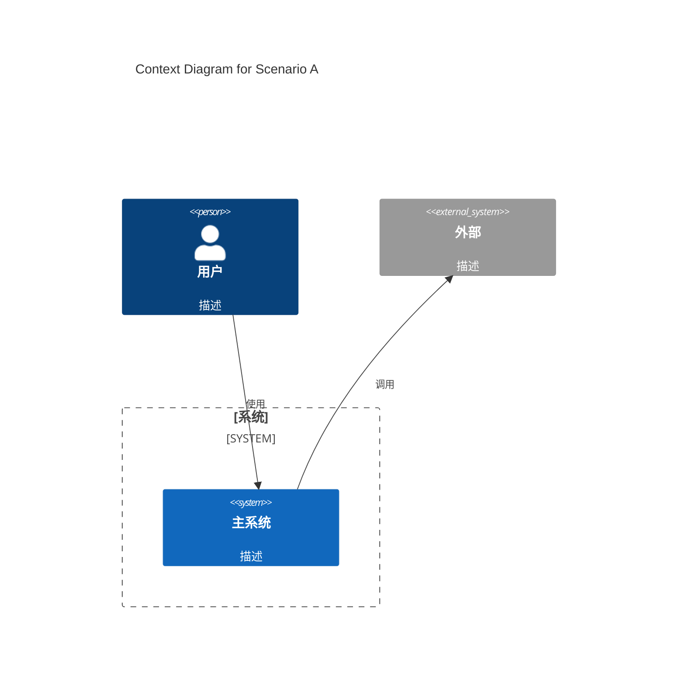
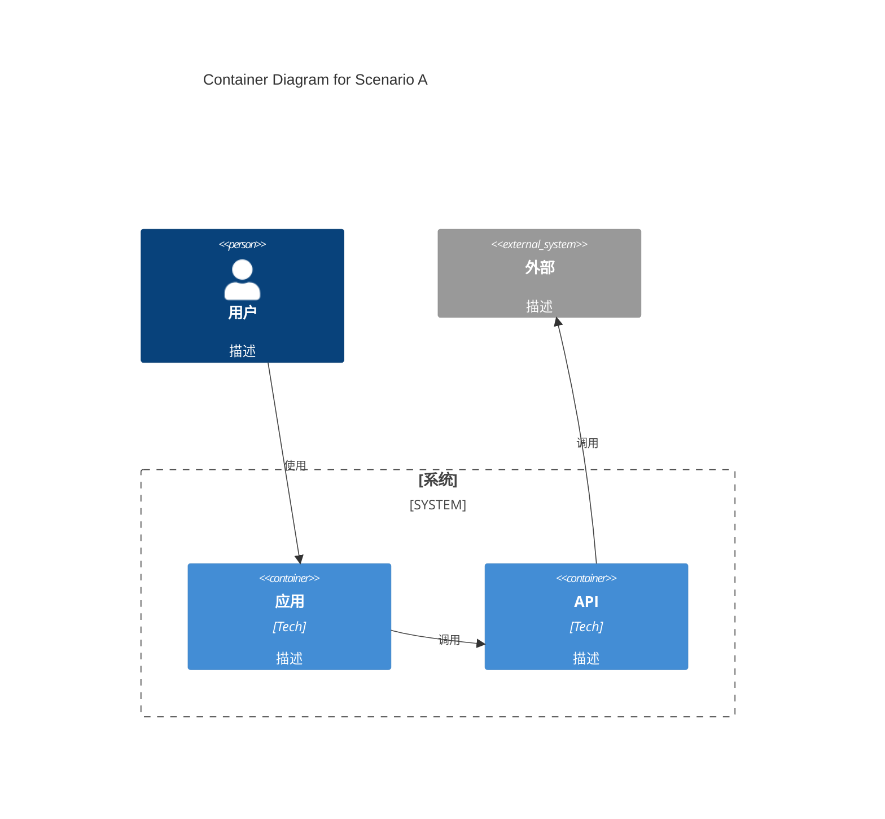
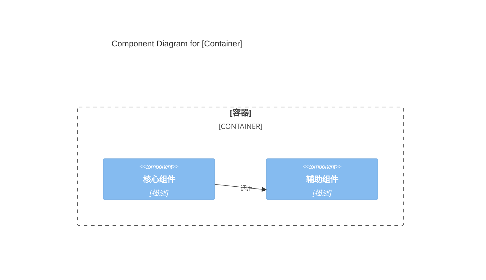
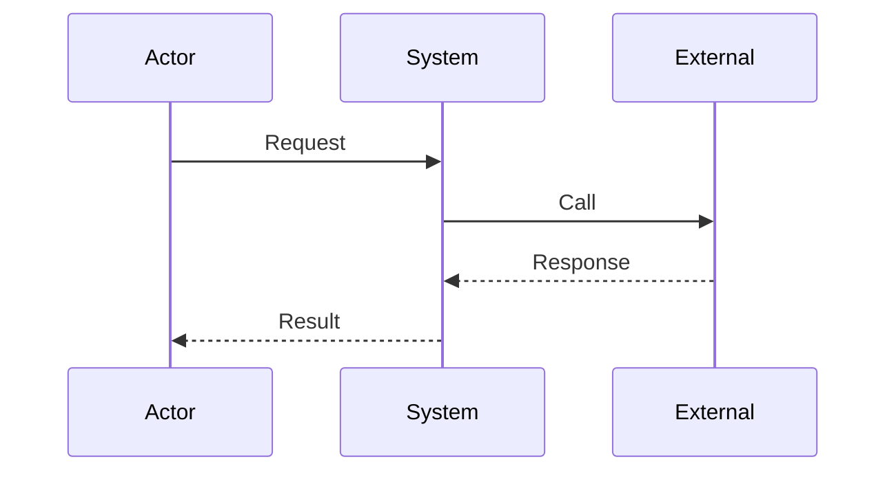
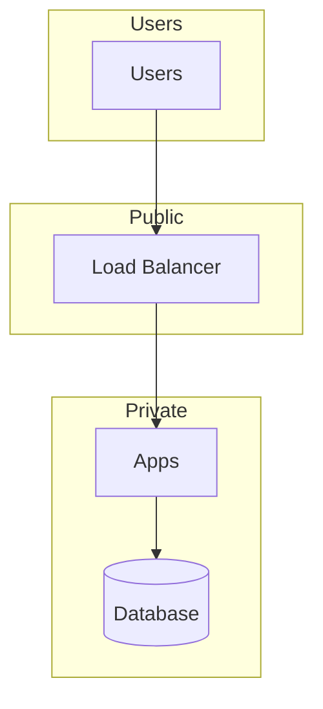
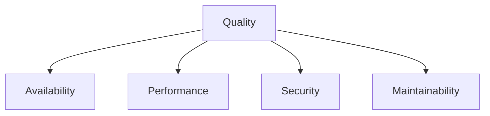

# Architecture Documentation: [System Name]

> **Detail Level:** THOROUGH (Comprehensive)
> **Output Format:** Markdown with Mermaid C4 Diagrams

---

## Table of Contents

1. [Introduction and Goals](#1-introduction-and-goals)
2. [Constraints](#2-constraints)
3. [Context and Scope](#3-context-and-scope)
4. [Solution Strategy](#4-solution-strategy)
5. [Building Block View](#5-building-block-view)
6. [Runtime View](#6-runtime-view)
7. [Deployment View](#7-deployment-view)
8. [Crosscutting Concepts](#8-crosscutting-concepts)
9. [Architecture Decisions](#9-architecture-decisions)
10. [Quality Requirements](#10-quality-requirements)
11. [Risks and Technical Debt](#11-risks-and-technical-debt)
12. [Glossary](#12-glossary)

---

## 1. Introduction and Goals

### 1.1 Requirements Overview

**System Purpose:**
[描述系统目的]

**Core Features:**

| Package | Feature |
|---------|---------|
| [包名] | [功能描述] |

### 1.2 Quality Goals (MANDATORY)

| Priority | Quality Goal | Concrete Scenario | Metric |
|:--------:|--------------|-------------------|--------|
| 1 | #[property] | [场景描述] | [具体指标] |
| 2 | #[property] | [场景描述] | [具体指标] |
| 3 | #[property] | [场景描述] | [具体指标] |

### 1.3 Stakeholders

| Role | Name | Contact | Expectations |
|------|------|---------|---------------|
| [Role] | [Name] | [Email] | [Expectations] |

---

## 2. Constraints

### 2.1 Technical Constraints

| Constraint | Source | Impact |
|------------|--------|--------|
| [Constraint] | [Source] | [Impact] |

### 2.2 Organizational Constraints

| Constraint | Source | Impact |
|------------|--------|--------|
| [Constraint] | [Source] | [Impact] |

### 2.3 Political/Regulatory Constraints

| Constraint | Source | Impact |
|------------|--------|--------|
| [Constraint] | [Source] | [Impact] |

---

## 3. Context and Scope

### 3.1 Scenario A: [场景名称]

**Scenario A Description:**
[描述]

---

### 3.2 Scenario B: [场景名称]

**Scenario B Description:**
[描述]

---

### 3.3 Technical Context

| Interface | Protocol | Data Format | Direction | SLA |
|-----------|----------|-------------|-----------|-----|
| [Name] | [Protocol] | [Format] | [Direction] | [SLA] |

---

## 4. Solution Strategy

### 4.1 Architecture Patterns

| Pattern | Application | Rationale | Trade-offs |
|---------|-------------|-----------|------------|
| [Pattern] | [Where] | [Why] | [Pros/Cons] |

### 4.2 Technology Decisions

| Category | Technology | Version | Rationale |
|----------|------------|---------|-----------|
| Language | TypeScript | >= 5.7 | Type safety |
| Runtime | Node.js | >= 20.0.0 | Wide support |

### 4.3 Achieving Quality Goals

| Quality Goal | Strategy | Verification |
|--------------|----------|--------------|
| [Goal] | [Strategy] | [Verification] |

---

## 5. Building Block View

### 5.1 Level-1: System Context

**System Overview:**
[描述]

---

### 5.2 Level-2: Container Diagram for Scenario A

**Description:**
[描述]

---

### 5.3 Level-3: Component Diagram

**Component Description:**

| Component | Responsibility | Design Notes |
|-----------|----------------|---------------|
| **Core** | [Responsibility] | [Notes] |
| **Helper** | [Responsibility] | [Notes] |

---

## 6. Runtime View

### 6.1 Scenario A Flow

---

## 7. Deployment View

### 7.1 Infrastructure

### 7.2 Deployment Mapping

| Component | Deployment | Infrastructure | Scaling |
|-----------|------------|-----------------|---------|
| [Component] | [Unit] | [Where] | [Policy] |

---

## 8. Crosscutting Concepts

### 8.1 Error Handling

**Motivation:**
[为什么需要]

**Description:**
[描述]

**Implementation:**
[实现方式]

### 8.2 Security

**Authentication:**
- API Key
- OAuth 2.0

**Authorization:**
- RBAC

### 8.3 Monitoring

- Logs: JSON structured
- Metrics: Prometheus
- Tracing: OpenTelemetry

---

## 9. Architecture Decisions

### ADR-001: [Title]

**Status:** Accepted | Deprecated | Superseded

**Date:** YYYY-MM-DD

**Deciders:** [Names]

**Context:**
[Problem statement]

**Decision:**
[Chosen solution]

**Consequences:**
- **Positive:** [Benefits]
- **Negative:** [Trade-offs]
- **Neutral:** [Other effects]

**Alternatives Considered:**
1. [Alternative 1]: [Description] - Rejected because: [Reason]

---

## 10. Quality Requirements

### 10.1 Quality Tree

### 10.2 Quality Scenarios

| ID | Scenario | Stimulus | Response | Metric | Priority |
|----|----------|----------|----------|--------|----------|
| Q01 | [Name] | [Trigger] | [Behavior] | [Target] | [H/M/L] |

---

## 11. Risks and Technical Debt

### 11.1 Risks

| ID | Risk | Probability | Impact | Mitigation |
|----|------|-------------|--------|------------|
| R01 | [Risk] | [H/M/L] | [H/M/L] | [Strategy] |

### 11.2 Technical Debt

| ID | Debt | Location | Reason | Remediation |
|----|------|----------|--------|-------------|
| TD01 | [Debt] | [Where] | [Why] | [Plan] |

---

## 12. Glossary

### Domain Terms

| Term | Definition |
|------|------------|
| [Term] | [Definition] |

### Technical Terms

| Term | Definition |
|------|------------|
| [Term] | [Definition] |

### Abbreviations

| Abbreviation | Full Form |
|--------------|-----------|
| [Abbr] | [Full] |

---

## Appendix: Revision History

| Version | Date | Author | Changes |
|---------|------|--------|---------|
| 1.0 | YYYY-MM-DD | [Name] | Initial version |

---

*Based on arc42 template*
