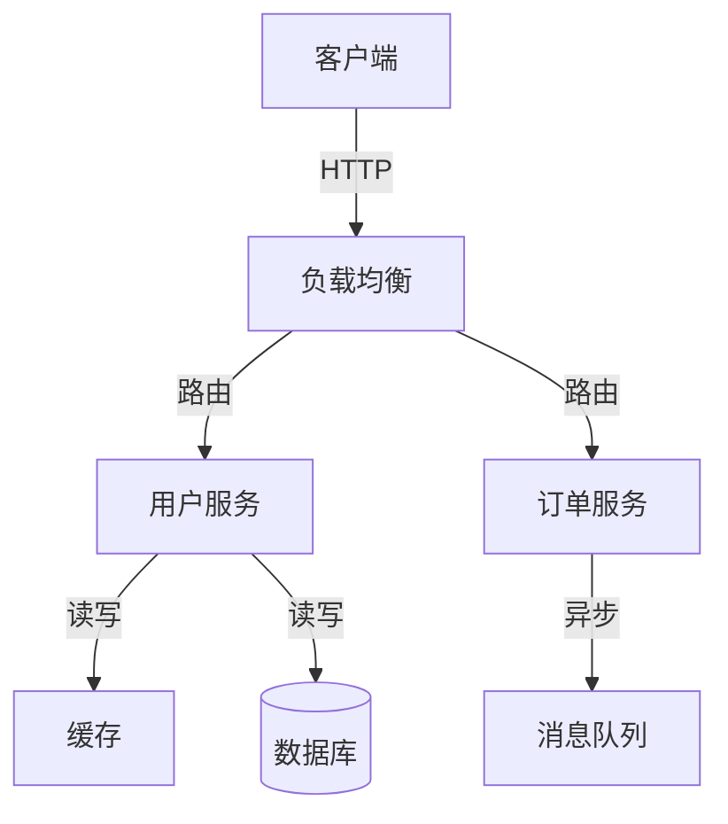
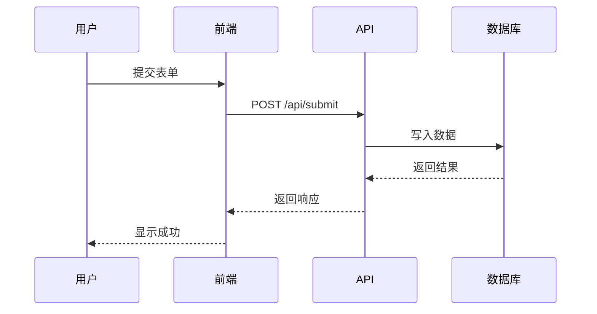
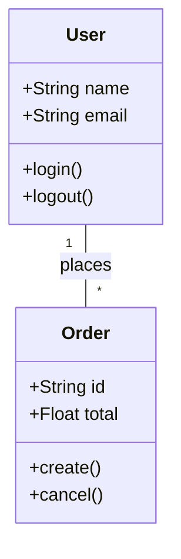
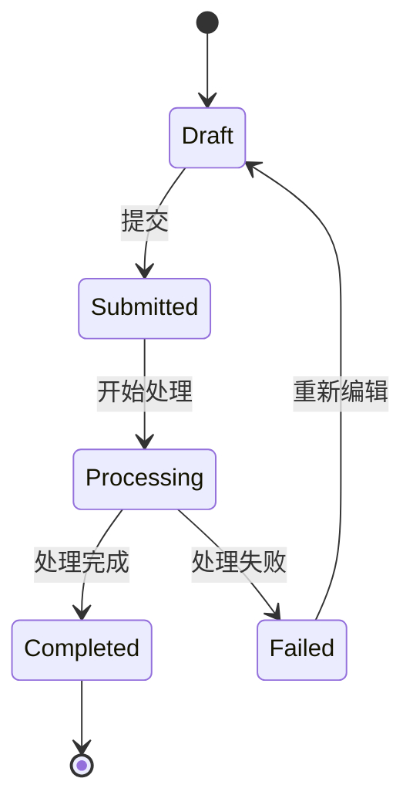
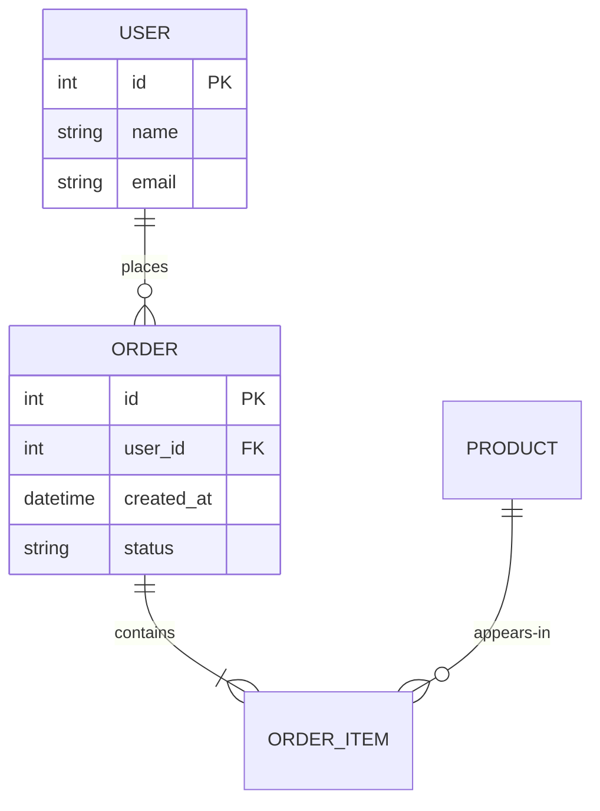
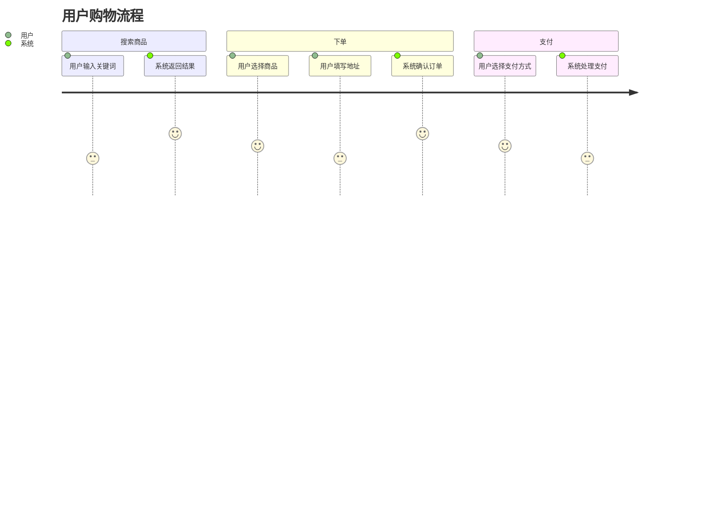
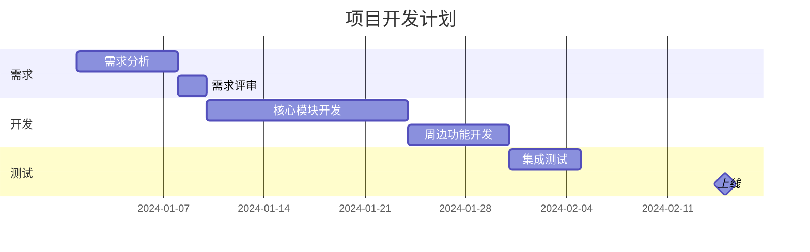
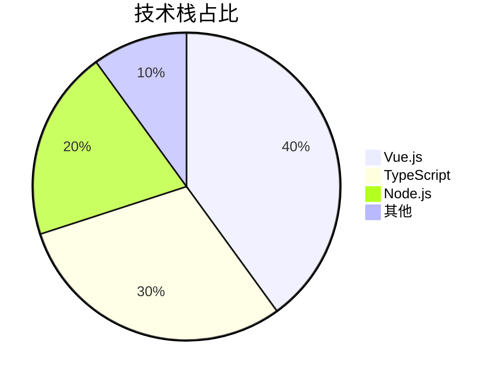
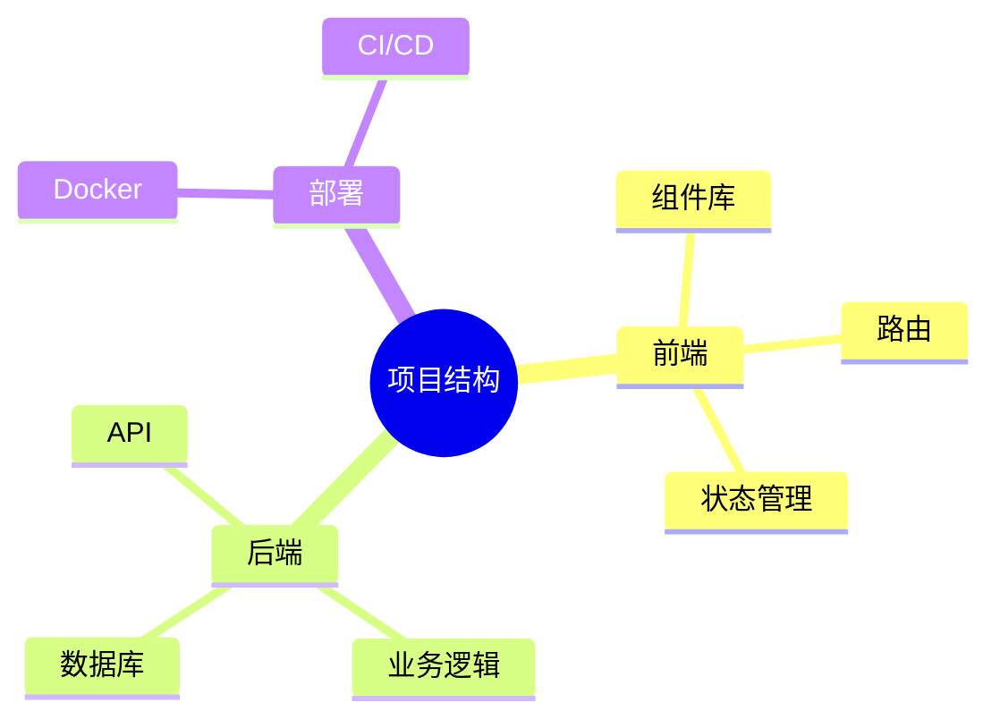
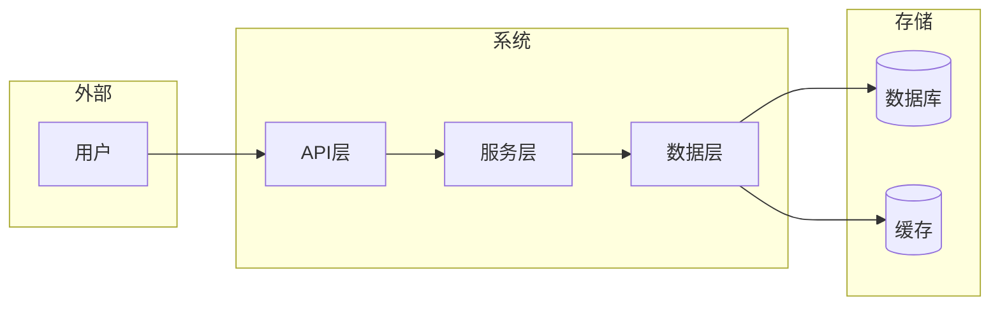

# Project Tutor - 项目导师

把任何项目变成可学习的教程，降低技术门槛，帮助理解陌生代码。

## 核心价值

1. **知识传承**：让团队新成员快速理解项目
2. **降低门槛**：帮助初学者学习陌生技术栈
3. **文档生成**：自动生成结构化项目文档
4. **增量更新**：基于Git历史跟踪项目变化

## 使用流程

### 步骤1：收集项目信息

分析目标项目，收集以下信息：

1. **项目类型**：Web应用、库、CLI工具、SDK等
2. **技术栈**：编程语言、框架、关键依赖
3. **目录结构**：核心模块划分
4. **入口文件**：main、index、app等入口
5. **配置文件**：package.json、Cargo.toml、requirements.txt等

使用工具：
- 列出项目根目录文件
- 查看 package.json / pyproject.toml / Cargo.toml 等
- 分析目录结构，识别核心模块
- 查看入口文件（main.ts, index.js, main.rs等）

### 步骤2：检测Git状态

检查是否为Git项目：

```bash
# 检查是否是git仓库
ls -la .git 2>/dev/null || echo "not-git"
git rev-parse HEAD 2>/dev/null
```

- **是Git项目**：读取 `.project-tutor-log.json` 获取上次生成的commit id
- **非Git项目**：询问用户是增量还是覆盖

### 步骤3：确定输出目录

询问用户输出路径，或使用默认值 `项目路径/docs-tutor/`

### 步骤4：生成文档

按照以下模板结构生成文档。每个文件 800-1200 字，使用费曼学习法风格。

## 文档模板结构

```
输出目录/
├── overview.md              # 项目总览（一句话 + 一张图）
├── problem.md               # 解决什么问题 + 背景
├── architecture.md          # 系统架构（含Mermaid图）
├── modules/                 # 核心模块详解
│   ├── [module-name].md    # 每个模块一个文件
├── details.md               # 详细设计
├── patterns.md              # 设计模式应用
├── code-style.md            # 代码风格与最佳实践
├── pitfalls.md              # 避坑指南
├── algorithms.md            # 算法与数据结构（如有）
├── dependencies.md          # 库与依赖详解
└── keywords.md              # 关键概念/术语解释
```

## 内容风格（费曼学习法）

每个文档遵循以下结构：

```markdown
# [主题名称]

## 一句话解释
用一句话说清楚这个主题是什么，用通俗的比喻引入。

## 解决什么问题
- 背景和痛点
- 为什么要用这个方案

## 核心思路
- 方案概述
- 关键设计点
- 架构图（Mermaid）

## 代码示例
- 核心代码片段
- 语法解读（新语言需要特别解释语法）
- 关键实现细节

## 最佳实践
- 常见用法
- 推荐的模式

## 避坑指南
- 常见错误
- 注意事项
- 调试技巧

## 相关概念
- 关键字解释
- 相关算法/数据结构
- 参考资料
```

## 智能推断规则

### 语言检测
- 检测项目使用的编程语言
- 如果是用户不熟悉的语言，在代码示例中添加语法解释
- 对比用户可能熟悉的语言来讲解

### 内容维度选择
根据项目特点自动决定生成哪些维度：

| 项目特点 | 包含的维度 |
|----------|-----------|
| 新技术栈 | syntax, keywords, patterns |
| 复杂业务 | architecture, details, patterns |
| 工具类 | algorithms, dependencies |
| Web应用 | architecture, patterns, pitfalls |

### 增量策略

**Git项目**：
```json
// .project-tutor-log.json
{
  "projectPath": "/path/to/project",
  "lastCommitId": "abc123",
  "lastGenerated": "2024-01-01T00:00:00Z",
  "generatedFiles": ["overview.md", "modules/auth.md"]
}
```

每次生成时：
1. 读取日志文件
2. 比较当前commit与记录的commit
3. 只生成有变化的部分
4. 更新日志文件

**非Git项目**：
- 询问用户：增量更新还是完全覆盖

## 图表规范

根据不同场景使用不同类型的 Mermaid 图表：

### 1. 系统架构图 (推荐: flowchart)



### 2. 时序图 (推荐: sequenceDiagram)



### 3. 类图 (推荐: classDiagram)



### 4. 状态图 (推荐: stateDiagram-v2)



### 5. 实体关系图 (推荐: erDiagram)



### 6. 用户旅程图 (推荐: journey)



### 7. 甘特图 (推荐: gantt)



### 8. 饼图 (推荐: pie)



### 9. 思维导图 (推荐: mindmap)



### 10. 数据流图 (用 flowchart 表示)



### 图表选择指南

| 场景 | 推荐图表 |
|------|---------|
| 系统架构 | flowchart |
| API调用顺序 | sequenceDiagram |
| 数据模型 | classDiagram, erDiagram |
| 业务流程 | stateDiagram-v2 |
| 用户操作流程 | journey |
| 项目进度 | gantt |
| 占比分析 | pie |
| 概念整理 | mindmap |

### 图表使用规则

1. **优先 Mermaid**：所有图表优先使用 Mermaid 语法
2. **自动选择**：根据内容类型自动选择合适的图表
3. **PNG/SVG补充**：如果 Mermaid 无法表达，建议用户手动添加图片
4. **保持简洁**：图表不要过于复杂，核心信息优先

## 代码示例处理

### 多语言通用
- 不假设特定语言
- 代码注释解释语法要点
- 关键语法点单独说明

### 语法解释模板
```markdown
### 语法点：[语法名称]

如果你是第一次接触 [语言]，这里解释一下：

```[语言]
// 代码示例
```

**含义**：...
**类似写法**（你可能熟悉的语言）：...
```

## 输出格式

生成完成后，输出摘要：

```markdown
## ✅ 教程生成完成

📁 输出目录：`/path/to/docs-tutor/`

📄 生成文件：
- overview.md
- problem.md
- architecture.md
- modules/auth.md
- ...

🔄 增量状态：[是/否]
📊 总字数：约 XXXX 字
```

## 示例对话

**用户**：帮我生成这个项目的教程

**你**：
1. 分析项目结构（列出文件、查看配置）
2. 检测Git状态
3. 询问输出路径
4. 生成文档
5. 输出摘要

## 输出格式选择

支持多种输出格式，询问用户需要哪种：

### 1. Markdown (默认)

生成分散的 MD 文件，便于版本控制和协作编辑。

```
输出目录/
├── overview.md
├── architecture.md
└── modules/
    └── auth.md
```

### 2. HTML

生成单页或带导航的 HTML 教程页面，支持：
- 响应式布局
- 语法高亮（Prism.js/Highlight.js）
- 目录导航
- 打印优化

```
输出目录/
├── index.html          # 入口页面
├── css/
│   └── style.css      # 样式文件
└── assets/
    └── diagrams/      # 图表资源
```

**HTML 模板结构**：
```html
<!DOCTYPE html>
<html lang="zh-CN">
<head>
    <meta charset="UTF-8">
    <meta name="viewport" content="width=device-width, initial-scale=1.0">
    <title>项目教程 - {项目名}</title>
    <link rel="stylesheet" href="css/prism.css">
    <link rel="stylesheet" href="css/style.css">
</head>
<body>
    <nav class="sidebar">
        <!-- 目录导航 -->
    </nav>
    <main class="content">
        <!-- 教程内容 -->
    </main>
    <script src="js/prism.js"></script>
</body>
</html>
```

### 3. PDF

生成可打印的 PDF 文档，适合离线阅读和分享。

**生成方式**：
1. 先生成 HTML
2. 使用工具转换：
   - `pandoc` + `wkhtmltopdf`
   - `markdown-pdf` (Node.js)
   - VS Code 的 Markdown PDF 插件

```
输出目录/
└── tutorial.pdf
```

**PDF 排版建议**：
- 页面大小：A4
- 边距：2cm
- 代码字体：Consolas, monospace
- 代码高亮主题：github-light 或 github-dark

### 4. 组合输出

可以一次生成多种格式：

```
输出格式：
□ Markdown (默认)
☑ HTML
☑ PDF
```

## 注意事项

- 每个文件控制在 800-1200 字
- 优先生成核心模块，其他可后续补充
- 使用简洁明了的语言，避免过度技术术语
- 代码示例要完整可运行
- 图表优先用Mermaid
