# 项目分析模板参考

## 编程语言检测

### 常见语言特征

| 语言 | 特征文件 | 入口文件 |
|------|---------|---------|
| JavaScript/TypeScript | package.json | index.js, main.ts, app.ts |
| Python | requirements.txt, pyproject.toml | main.py, app.py |
| Java | pom.xml, build.gradle | Main.java |
| Go | go.mod | main.go |
| Rust | Cargo.toml | main.rs |
| C# | .csproj | Program.cs |
| PHP | composer.json | index.php |

## 模块识别规则

### Web应用常见模块

```
src/
├── api/           # API层
├── controller/    # 控制器
├── service/       # 业务逻辑
├── model/         # 数据模型
├── repository/   # 数据访问
├── middleware/    # 中间件
├── utils/         # 工具函数
└── config/        # 配置
```

### 库/SDK常见模块

```
src/
├── core/          # 核心功能
├── client/        # 客户端
├── server/        # 服务端
├── types/         # 类型定义
└── utils/         # 工具
```

## 架构图模板

### 分层架构

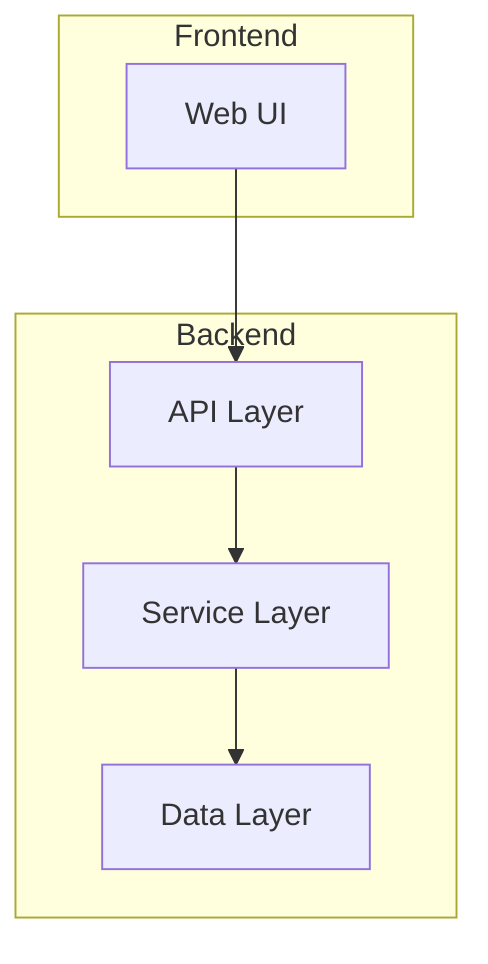

### 微服务架构

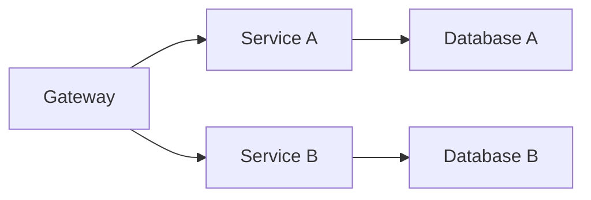

## 文档字数控制

| 复杂度 | 字数范围 | 拆分建议 |
|--------|---------|---------|
| 简单 | 300-500 | 合并到相关章节 |
| 标准 | 800-1200 | 独立文件 |
| 复杂 | 1500+ | 拆分为多个子主题 |

## 费曼学习法应用

### 一句话解释模板

> 如果你只能向一个5岁孩子解释这个概念，你会怎么说？

示例：
- **Git**: 就像一个时光机，帮你记住每次修改的内容，随时可以回到过去
- **API**: 就像餐厅的服务员，你告诉它要什么，它去厨房帮你拿来

### 比喻对照表

| 概念 | 通俗比喻 |
|------|---------|
| 服务器 | 24小时营业的商店 |
| 数据库 | 大型图书馆 |
| API | 餐厅菜单 |
| 缓存 | 口袋里的常用物品 |
| 异步 | 发短信而不是打电话 |

## 图表模板库

### 场景1：REST API 流程

#### 时序图 - API调用

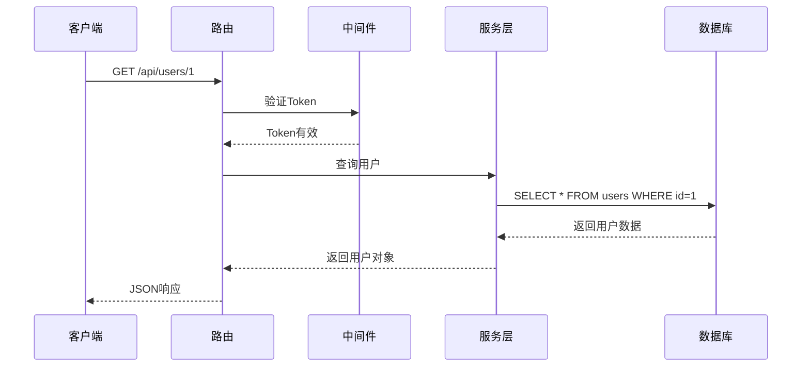

#### 状态图 - 订单流程

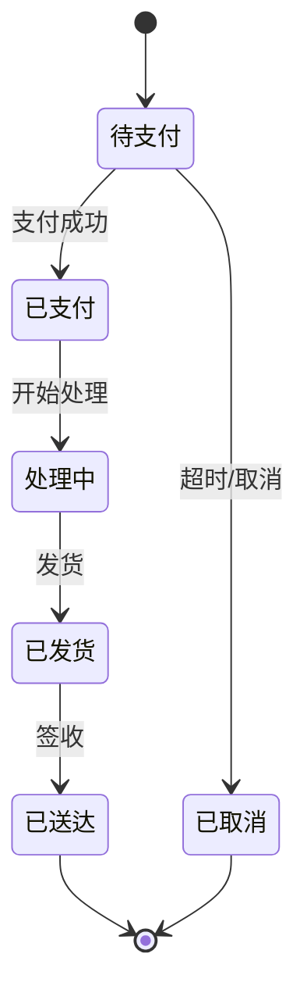

### 场景2：微服务架构

#### 架构图 - 服务通信

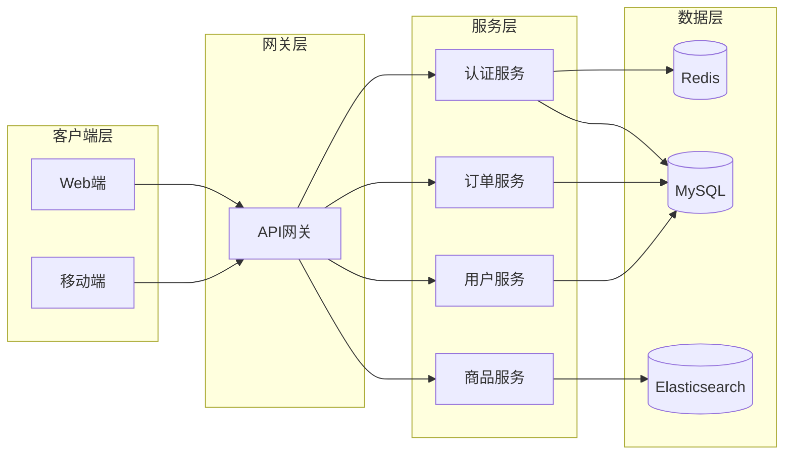

#### ER图 - 核心数据模型

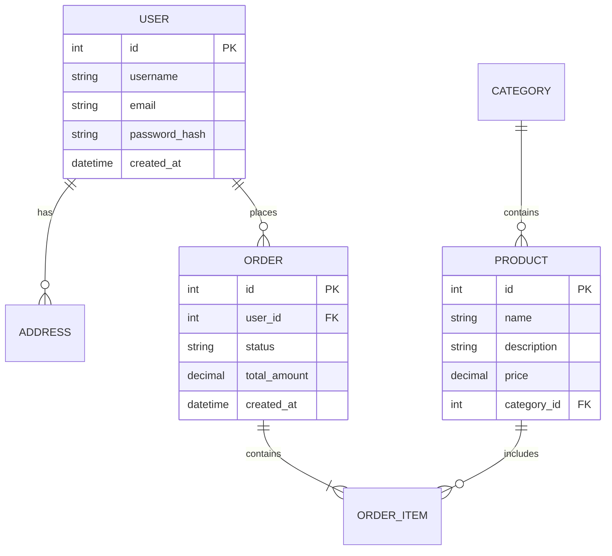

### 场景3：前端组件架构

#### 类图 - 组件关系

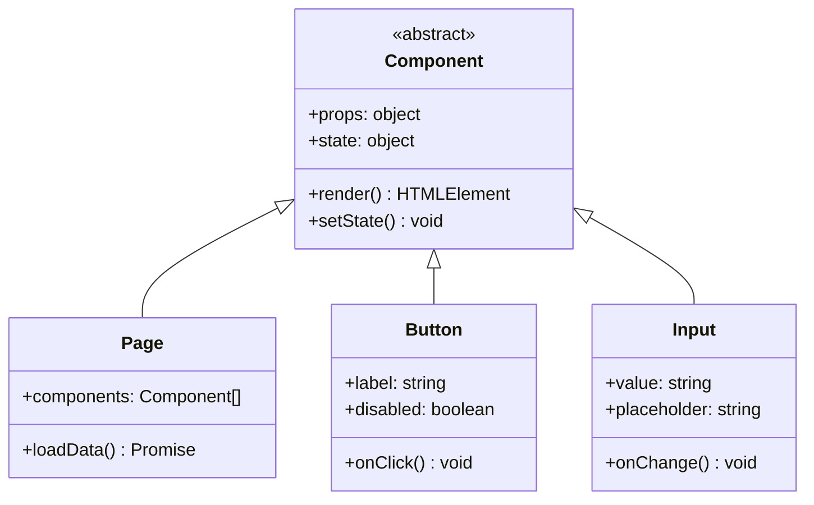

#### 思维导图 - 技术栈

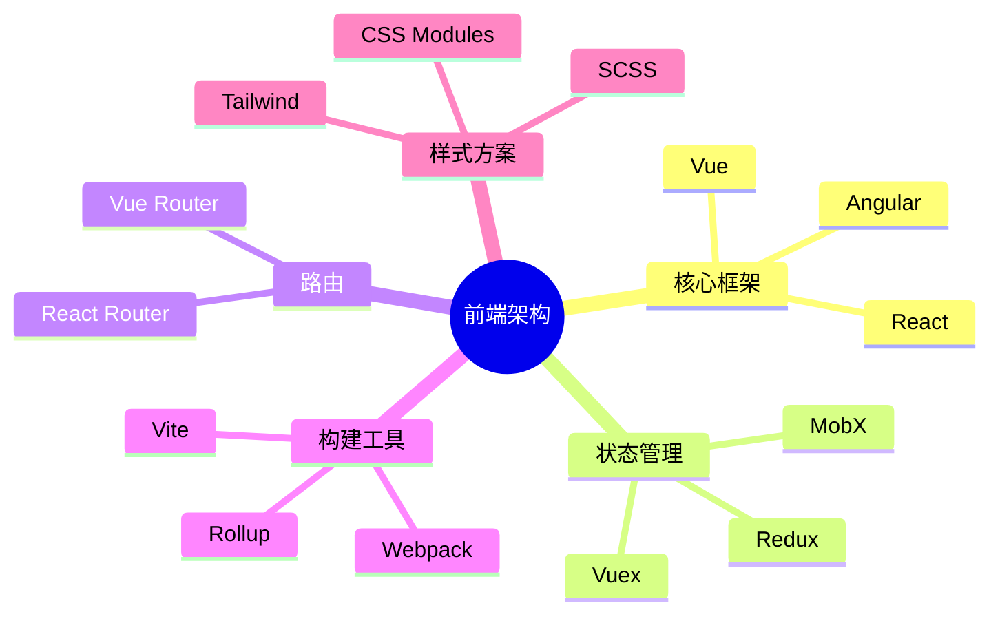

### 场景4：项目进度管理

#### 甘特图 - 开发周期

```mermaid
gantt
    title 项目里程碑
    dateFormat  YYYY-MM-DD
    axisFormat  %m-%d

    section 阶段一
      需求分析       :a1, 2024-01-01, 5d
      原型设计       :a2, after a1, 4d
      技术方案       :a3, after a2, 3d

    section 阶段二
      核心功能开发   :b1, after a3, 10d
      接口开发       :b2, parallel, 7d
      前端开发       :b3, parallel, 7d

    section 阶段三
      集成测试       :c1, after b1, 5d
      Bug修复        :c2, after c1, 3d
      上线发布       :milestone, 2024-02-01, 0d
```

### 场景5：用户旅程

#### 用户旅程图 - 注册流程

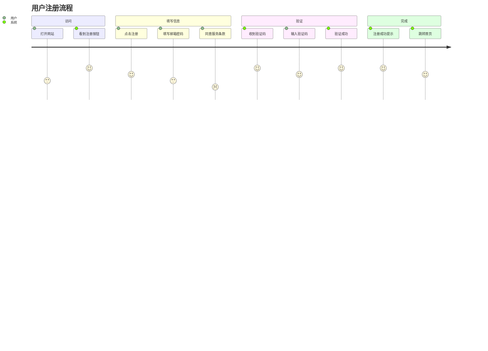

### 场景6：数据分析

#### 饼图 - 依赖占比

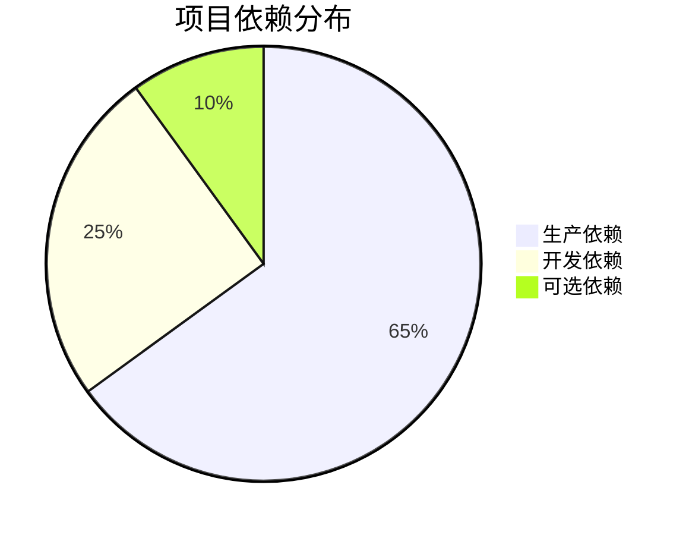

### 场景7：数据流处理

#### 数据流图 - ETL流程

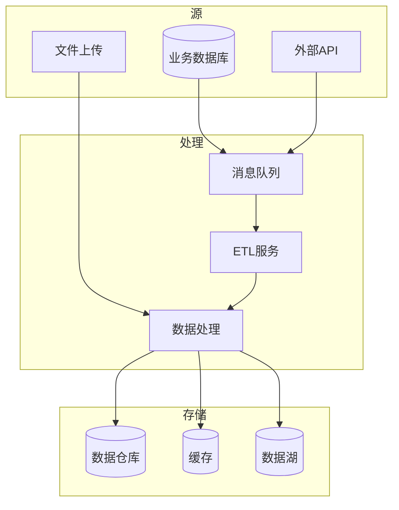

### 图表选择速查表

| 内容类型 | 推荐图表 | 关键字 |
|---------|---------|--------|
| 系统架构 | flowchart | 分层、微服务、组件 |
| 调用流程 | sequenceDiagram | API、交互、顺序 |
| 数据模型 | classDiagram, erDiagram | 类、表、关系 |
| 业务流程 | stateDiagram-v2 | 状态、流转、生命周期 |
| 用户行为 | journey | 流程、体验、步骤 |
| 项目进度 | gantt | 计划、里程碑、日期 |
| 概念整理 | mindmap | 分类、层级、主题 |
| 占比分析 | pie | 分布、统计、比例 |

## HTML 输出模板

### 单页HTML模板

```html
<!DOCTYPE html>
<html lang="zh-CN">
<head>
    <meta charset="UTF-8">
    <meta name="viewport" content="width=device-width, initial-scale=1.0">
    <title>${项目名} - 教程</title>
    <style>
        /* 基础样式 */
        :root {
            --primary: #2563eb;
            --bg: #ffffff;
            --text: #1f2937;
            --code-bg: #f6f8fa;
        }
        body {
            font-family: -apple-system, BlinkMacSystemFont, 'Segoe UI', sans-serif;
            line-height: 1.6;
            max-width: 800px;
            margin: 0 auto;
            padding: 2rem;
            color: var(--text);
        }
        pre {
            background: var(--code-bg);
            padding: 1rem;
            border-radius: 8px;
            overflow-x: auto;
        }
        code {
            font-family: 'Fira Code', Consolas, monospace;
        }
        .mermaid {
            text-align: center;
            margin: 2rem 0;
        }
    </style>
    <!-- Mermaid -->
    <script src="https://cdn.jsdelivr.net/npm/mermaid/dist/mermaid.min.js"></script>
    <!-- 语法高亮 -->
    <link rel="stylesheet" href="https://cdnjs.cloudflare.com/ajax/libs/prism/1.29.0/themes/prism.min.css">
</head>
<body>
    <header>
        <h1>${项目名}</h1>
        <p class="description">${一句话介绍}</p>
    </header>

    <nav class="toc">
        <h2>目录</h2>
        <ul>
            <li><a href="#overview">项目总览</a></li>
            <li><a href="#problem">解决什么问题</a></li>
            <li><a href="#architecture">系统架构</a></li>
            <li><a href="#modules">核心模块</a></li>
        </ul>
    </nav>

    <main>
        ${教程内容}
    </main>

    <footer>
        <p>Generated by Project Tutor</p>
    </footer>

    <script>
        mermaid.initialize({ startOnLoad: true });
    </script>
    <script src="https://cdnjs.cloudflare.com/ajax/libs/prism/1.29.0/prism.min.js"></script>
    <script src="https://cdnjs.cloudflare.com/ajax/libs/prism/1.29.0/components/prism-javascript.min.js"></script>
    <script src="https://cdnjs.cloudflare.com/ajax/libs/prism/1.29.0/components/prism-python.min.js"></script>
</body>
</html>
```

### 侧边栏导航HTML模板

```html
<!DOCTYPE html>
<html lang="zh-CN">
<head>
    <meta charset="UTF-8">
    <meta name="viewport" content="width=device-width, initial-scale=1.0">
    <title>${项目名} - 教程</title>
    <style>
        * { box-sizing: border-box; margin: 0; padding: 0; }
        body {
            display: flex;
            min-height: 100vh;
        }
        .sidebar {
            width: 280px;
            background: #1e293b;
            color: #e2e8f0;
            padding: 1.5rem;
            position: fixed;
            height: 100vh;
            overflow-y: auto;
        }
        .sidebar h1 {
            font-size: 1.25rem;
            margin-bottom: 1.5rem;
            padding-bottom: 1rem;
            border-bottom: 1px solid #334155;
        }
        .sidebar nav ul {
            list-style: none;
        }
        .sidebar nav a {
            color: #94a3b8;
            text-decoration: none;
            display: block;
            padding: 0.5rem 0;
            transition: color 0.2s;
        }
        .sidebar nav a:hover {
            color: #fff;
        }
        .main {
            flex: 1;
            margin-left: 280px;
            padding: 2rem 3rem;
            max-width: 900px;
        }
        .main h1, .main h2, .main h3 {
            margin-top: 2rem;
            margin-bottom: 1rem;
        }
        pre {
            background: #f6f8fa;
            padding: 1rem;
            border-radius: 6px;
            overflow-x: auto;
            margin: 1rem 0;
        }
        @media (max-width: 768px) {
            .sidebar { display: none; }
            .main { margin-left: 0; padding: 1rem; }
        }
    </style>
</head>
<body>
    <aside class="sidebar">
        <h1>${项目名}</h1>
        <nav>
            <ul>
                <li><a href="#overview">项目总览</a></li>
                <li><a href="#problem">解决什么问题</a></li>
                <li><a href="#architecture">系统架构</a></li>
                <li><a href="#modules">核心模块</a></li>
                <li><a href="#details">详细设计</a></li>
                <li><a href="#patterns">设计模式</a></li>
                <li><a href="#pitfalls">避坑指南</a></li>
            </ul>
        </nav>
    </aside>
    <main class="main">
        ${教程内容}
    </main>
</body>
</html>
```

## PDF 生成配置

### Pandoc 命令示例

```bash
# Markdown 转 PDF
pandoc input.md -o output.pdf \
    --pdf-engine=wkhtmltopdf \
    --css=style.css \
    -V mainfont="PingFang SC" \
    -V geometry:margin=2cm

# 合并多个 md 文件
pandoc part1.md part2.md part3.md -o tutorial.pdf
```

### 推荐 PDF 配置

```yaml
# _config.yml (用于静态网站生成)
pdf:
  page_size: A4
  margin: 2cm
  mainfont: "PingFang SC, Microsoft YaHei"
  code_fonts:
    - "Fira Code"
    - "Consolas"
  theme: github-light
  header: |
    \\centering
    \\small{项目教程}
  footer: |
    \\centering
    \\small{第 \\thepage{} 页 共 \\pageref{LastPage} 页}
```
